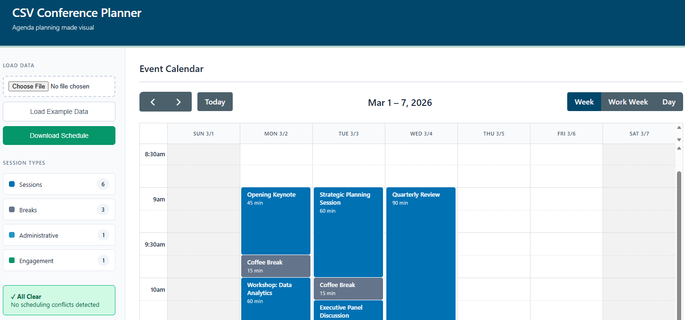

# CSV Conference Planner

**A local planning tool for mapping out conference and meeting schedules.**

Load a CSV spreadsheet of your sessions, view them on an interactive calendar, and drag and drop to adjust. The visual layout makes it easy to spot scheduling conflicts, see where attendee breaks are placed, and check how interactive sessions are spread across the day.

---

## Screenshot

---

## Features

- **Upload your CSV** — import your existing session spreadsheet in seconds
- **Visual calendar view** — see your entire conference laid out by day and time
- **Drag and drop** — reschedule sessions by dragging them to a new time slot
- **Conflict detection** — overlapping sessions are flagged automatically
- **Session types** — color-coded categories for Sessions, Breaks, Administrative, and Engagement events
- **Add and edit sessions** — click any time slot to add a new session, or click an existing one to edit it
- **Download your schedule** — export the updated schedule back to CSV at any time
- **No internet required** — once the page loads, everything runs locally in your browser

---

## Getting Started

1. Download the `index.html` file from this repository
2. Open it in any modern web browser (Chrome, Firefox, Edge, Safari)
3. The example schedule loads automatically so you can see how it works straight away. When you're ready, download the [example CSV](example_schedule.csv), edit it with your own sessions in Excel or Google Sheets, and upload it using the **Load Data** button

---

## CSV Format Guide

Your CSV file must include the following column headers in the first row (see example CSV):

| Column | Description | Example |
|---|---|---|
| `session_name` | Title of the session | Opening Keynote |
| `author` | Presenter or responsible party | Data Team |
| `starts_at` | Start date and time | 2026-03-10 09:00:00 AM |
| `ends_at` | End date and time | 2026-03-10 10:00:00 AM |
| `duration` | Length in minutes | 60 |
| `type` | Session category (see below) | session |

### Session Types

The `type` column accepts four values:

| Value | Colour | Use for |
|---|---|---|
| `session` | Blue | Talks, workshops, panels |
| `break` | Grey | Coffee breaks, lunch, rest periods |
| `administrative` | Light blue | Registration, technical reviews, logistics |
| `engagement` | Green | Networking, social events, open discussions |

---

